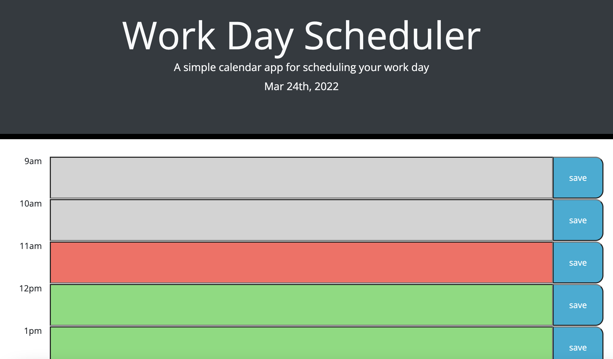

# Day Planner

## Description

As a working professional, it is important to be able to track different tasks and events throughout the day in order to work well with your collegues and get tasks done in a timely fashion. This can be aided with a work day planner. This application is a day planner where you can input your events and tasks during regular business hours. Your plans will be saved in the browser so that you do not have to worry about keeping the application open. You can feel free to leave and return without fear of losing your plans.

### What I learned
While doing this project I learned to get current dates and times using the moment.js API. I also got comfortable with using jQuery methods and Bootstrap classes to format the document.

## Usage

The webpage can be found at [this link](https://carol-tsai.github.io/day-planner/)

Upon load the page, the header will display the current date. 

When you scroll down, there will be a time table for regular business hours. The hours that are in the past will be colored gray, the current hour will be red, and the remaining hours in the workday will be green. 

To enter something into the planner, click the colored box and type in your info. Click the save button to save your plans to your browser storage. Now when you return to the page, you planner will automatically be updated with your plans.

## Credits

Skeleton code for the index.html and stylesheet files was copied from UPenn LPS Coding Bootcamp course material.

### Reference documents

* [jQuery Documentation](https://api.jquery.com/)

* [Moment.js Documentation](https://momentjs.com/docs/)

* [Bootstrap documentation](https://getbootstrap.com/docs/4.0)

* [HTML data attributes](https://developer.mozilla.org/en-US/docs/Learn/HTML/Howto/Use_data_attributes)

## How to Contribute
Please reach out to me at carol.tsai0224@gmail.com if you would like to contribute to this project.

## License

MIT License

Copyright (c) 2022 Carol Tsai

Permission is hereby granted, free of charge, to any person obtaining a copy
of this software and associated documentation files (the "Software"), to deal
in the Software without restriction, including without limitation the rights
to use, copy, modify, merge, publish, distribute, sublicense, and/or sell
copies of the Software, and to permit persons to whom the Software is
furnished to do so, subject to the following conditions:

The above copyright notice and this permission notice shall be included in all
copies or substantial portions of the Software.

THE SOFTWARE IS PROVIDED "AS IS", WITHOUT WARRANTY OF ANY KIND, EXPRESS OR
IMPLIED, INCLUDING BUT NOT LIMITED TO THE WARRANTIES OF MERCHANTABILITY,
FITNESS FOR A PARTICULAR PURPOSE AND NONINFRINGEMENT. IN NO EVENT SHALL THE
AUTHORS OR COPYRIGHT HOLDERS BE LIABLE FOR ANY CLAIM, DAMAGES OR OTHER
LIABILITY, WHETHER IN AN ACTION OF CONTRACT, TORT OR OTHERWISE, ARISING FROM,
OUT OF OR IN CONNECTION WITH THE SOFTWARE OR THE USE OR OTHER DEALINGS IN THE
SOFTWARE.